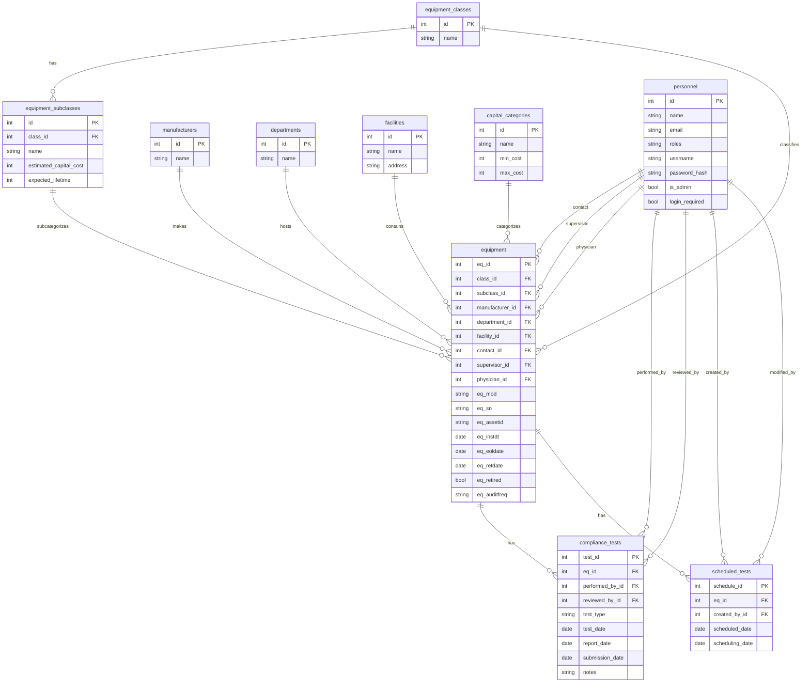

# Database Diagram

```mermaid
erDiagram
    equipment_classes ||--o{ equipment_subclasses : "has"
    equipment_classes ||--o{ equipment : "classifies"
    equipment_subclasses ||--o{ equipment : "subcategorizes"
    manufacturers ||--o{ equipment : "makes"
    departments ||--o{ equipment : "hosts"
    facilities ||--o{ equipment : "contains"
    capital_categories ||--o{ equipment : "categorizes"

    personnel ||--o{ equipment : "contact"
    personnel ||--o{ equipment : "supervisor"
    personnel ||--o{ equipment : "physician"
    personnel ||--o{ compliance_tests : "performed_by"
    personnel ||--o{ compliance_tests : "reviewed_by"
    personnel ||--o{ scheduled_tests : "created_by"
    personnel ||--o{ scheduled_tests : "modified_by"

    equipment ||--o{ compliance_tests : "has"
    equipment ||--o{ scheduled_tests : "has"

    equipment {
        int eq_id PK
        int class_id FK
        int subclass_id FK
        int manufacturer_id FK
        int department_id FK
        int facility_id FK
        int contact_id FK
        int supervisor_id FK
        int physician_id FK
        string eq_mod
        string eq_sn
        string eq_assetid
        date eq_instdt
        date eq_eoldate
        date eq_retdate
        bool eq_retired
        string eq_auditfreq
    }

    personnel {
        int id PK
        string name
        string email
        string roles
        string username
        string password_hash
        bool is_admin
        bool login_required
    }

    compliance_tests {
        int test_id PK
        int eq_id FK
        int performed_by_id FK
        int reviewed_by_id FK
        string test_type
        date test_date
        date report_date
        date submission_date
        string notes
    }

    scheduled_tests {
        int schedule_id PK
        int eq_id FK
        int created_by_id FK
        date scheduled_date
        date scheduling_date
    }

    equipment_classes {
        int id PK
        string name
    }

    equipment_subclasses {
        int id PK
        int class_id FK
        string name
        int estimated_capital_cost
        int expected_lifetime
    }

    facilities {
        int id PK
        string name
        string address
    }

    departments {
        int id PK
        string name
    }

    manufacturers {
        int id PK
        string name
    }

    capital_categories {
        int id PK
        string name
        int min_cost
        int max_cost
    }
```
